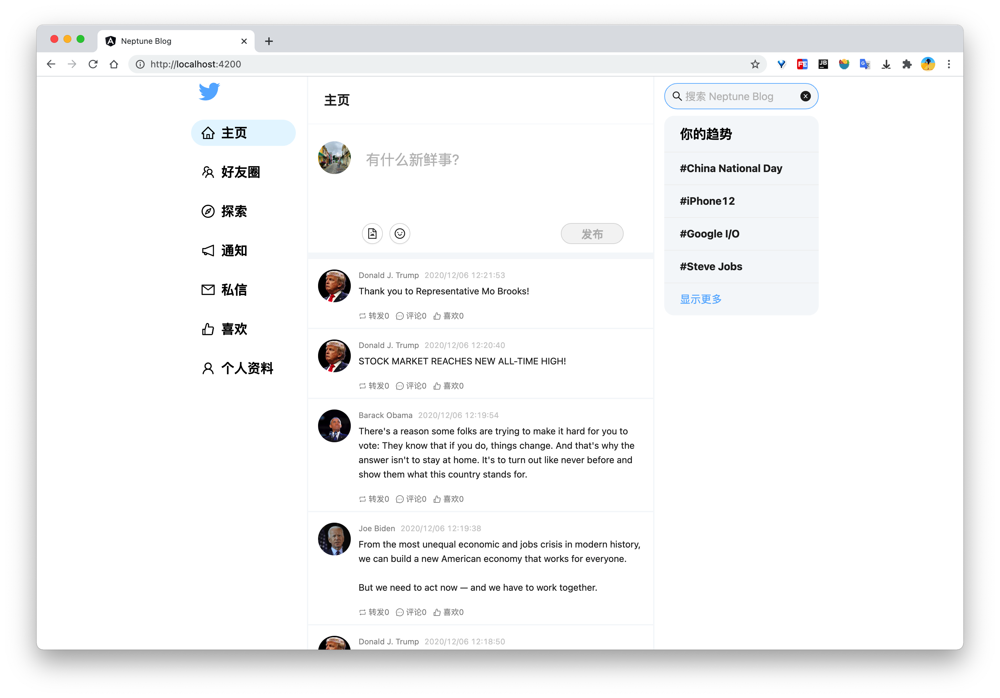
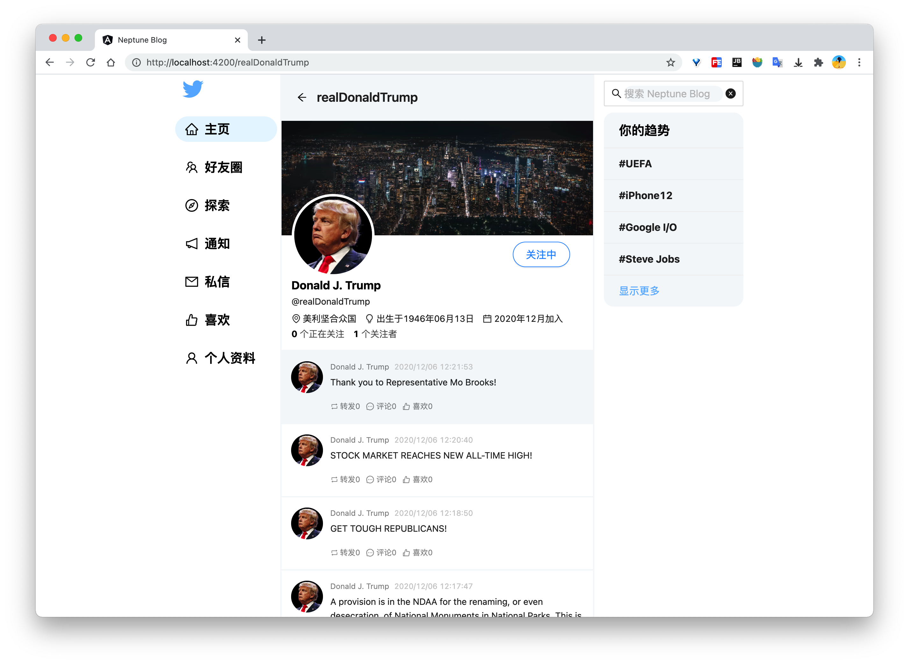

# NeptuneBlog

基于Spring Cloud Netflix的MicroBlog

## 项目地址

- 前端 <https://github.com/liuweigeek/NeptuneBlog-frontend>
- 后端 <https://github.com/liuweigeek/NeptuneBlog-backend>

## 项目截图

### 主页

### 个人资料页

## 部署步骤

### 中间件部署

- 打开 [docs/docker/services](https://github.com/liuweigeek/NeptuneBlog-backend/tree/master/docs/Docker/services)
  中对应版本的Docker Compose配置文件, 修改volumes为自己的本地路径，统一部署中间件
- 执行 [docs/script/DDL.sql](https://github.com/liuweigeek/NeptuneBlog-backend/tree/master/docs/script/DDL.sql) 中的数据库初始化脚本
- 启动eureka-server，然后依次启动其他服务
- 启动前端项目 [NeptuneBlog-frontend](https://github.com/liuweigeek/NeptuneBlog-frontend)
  ,然后在浏览器中访问<http://localhost:4200/auth/signIn>

## 功能模块

## common

通用代码模块

## eureka-server

注册中心，使用Eureka Server

## config-server

配置中心，使用Spring Cloud Config

## api-gateway

网关模块，使用Ribbon、Zuul和Hystrix

## authentication

授权中心模块，使用Eureka Client、Spring Security、JWT

## user

用户模块，使用Eureka Client、Spring Data JPA、MySQL

## tweet

推文模块，使用Eureka Client、Spring Data JPA、MySQL

## mail

邮件模块，使用Eureka Client

## ❤️ Contributing

